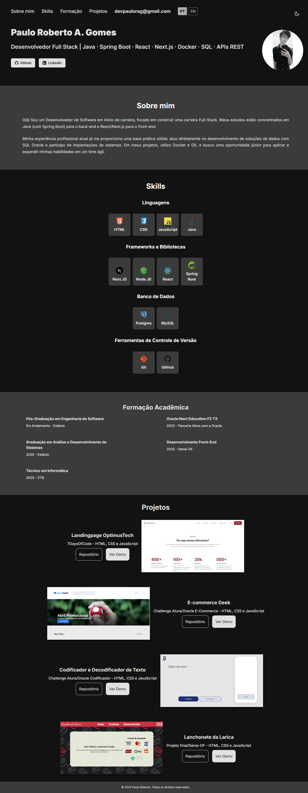

# 💼 Portfólio | Paulo Roberto A. Gomes

[]()
[]()
[]()
[]()
[]()
[](https://pauloragdev.vercel.app/)

[Read this document in English (Leia em Inglês)](README.md)

Este projeto representa meu portfólio profissional, desenvolvido com **HTML5**, **CSS3** e **JavaScript Vanilla**. Ele exibe minhas habilidades, formação e projetos em uma interface limpa, responsiva e bilíngue.

---

## 📁 Estrutura do Projeto

```
├── assets
│   ├── css
│   │   ├── components
│   │   └── global
│   └── image
├── scripts
│   ├── functions
│   └── main.js
├── index.html
```

---

---

## ✨ Funcionalidades

-   **Bilíngue (i18n):** Internacionalização PT/EN implementada com JavaScript puro, com a preferência do usuário salva no `localStorage`.
-   **Tema Claro/Escuro:** Suporte a modo claro e escuro.
-   **Design Responsivo:** Layout _mobile-first_ para todos os tamanhos de tela.
-   **Código Modularizado:** CSS e JS organizados em módulos para manutenção.
-   **Navegação Suave (scroll):** Navegação fluida entre as seções.
-   **Seções:** Sobre, Formação, Skills, Projetos.

---

## 🔧 Tecnologias utilizadas

-   HTML5
-   CSS3 (Flexbox, Grid, Variáveis)
-   JavaScript (Vanilla, Módulos ES6)
-   Organização por componentes

---

## 📷 Preview



---

## 📫 Contato

-   [LinkedIn](https://www.linkedin.com/in/paulorag/)
-   [Portfólio Online](https://pauloragdev.vercel.app/)
-   Email: devpaulorag@gmail.com
