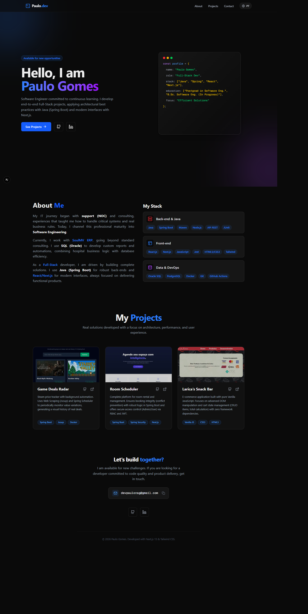

# 🚀 Paulo Gomes | Full-Stack Developer Portfolio

[Read this document in Portuguese (Leia em Português)](README-pt.md)

A modern, high-performance developer portfolio built to showcase my projects and skills as a **Full-Stack Developer**. Designed with a focus on **User Experience**, **Accessibility**, and **Clean Code**.

---

## 🌐 Live Demo

[Click here to visit the live site](https://pauloragdev.vercel.app)

---

## ✨ Features

-   **🎨 Modern UI/UX:** Dark mode aesthetic with glassmorphism effects and smooth animations using **Framer Motion**.
-   **🌍 Internationalization (i18n):** Built-in support for **Portuguese (PT-BR)** and **English (EN)** using React Context API (no external heavy libraries).
-   **⚡ Performance:** Built on **Next.js 15** (App Router) for server-side rendering and optimized performance.
-   **📱 Fully Responsive:** Adaptive layout that works perfectly on desktops, tablets, and mobile devices via **Tailwind CSS**.
-   **🖱️ Smooth Scroll:** Integrated with **Lenis** for a premium scrolling experience.
-   **📋 Interactive Elements:** Copy-to-clipboard functionality for contact info and dynamic project cards.

---

## 🛠️ Tech Stack

This project harnesses the power of the latest web technologies:

-   **Framework:** Next.js 15 (App Router)
-   **Language:** TypeScript
-   **Styling:** Tailwind CSS
-   **Animations:** Framer Motion
-   **Icons:** Lucide React
-   **Scrolling:** Lenis
-   **Deployment:** Vercel

---

## 🚀 Getting Started

To run this project locally, follow these steps:

### Prerequisites

Make sure you have **Node.js** (v18 or higher) installed.

### Installation

1. Clone the repository:

    git clone https://github.com/paulorag/portfolio.git

2. Navigate to the project directory:

    cd portfolio

3. Install dependencies:

    npm install

    # or

    yarn install

4. Run the development server:

    npm run dev

5. Open your browser:
   Visit http://localhost:3000 to see the application running.

---

## 📂 Project Structure

    src/
    ├── app/              # App Router pages and layout
    ├── components/       # Reusable UI components
    │   ├── layout/       # Header, Footer
    │   ├── sections/     # Hero, About, Projects
    │   └── ui/           # Buttons, Scroll wrappers
    ├── context/          # React Context (Language/i18n)
    ├── lib/              # Utilities and Dictionary data
    └── public/           # Static assets (images, icons)

---

## 📫 Contact

Developed by **Paulo Gomes**.

-   **LinkedIn:** [Paulo Gomes](https://linkedin.com/in/paulorag)
-   **GitHub:** [paulorag](https://github.com/paulorag)
-   **Email:** devpaulorag@gmail.com

---

© 2025 Paulo Gomes. All rights reserved.
