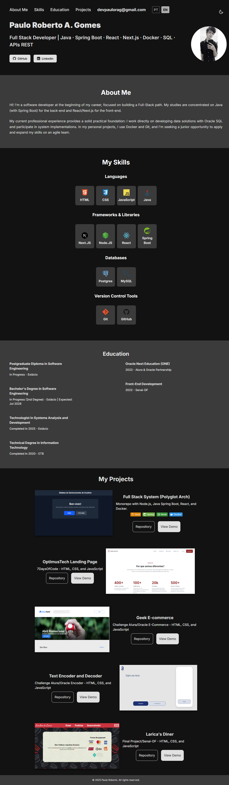

# 💼 Paulo Roberto A. Gomes's Portfolio

[]()
[]()
[]()
[]()
[]()
[](https://pauloragdev.vercel.app/)

[Read this document in Portuguese (Leia em Português)](README-pt.md)

This project is my professional portfolio, built from scratch with **HTML5**, **CSS3**, and **Vanilla JavaScript**. It showcases my skills, education, and projects in a clean, responsive, and bilingual interface.

---

## 📁 Project Structure

```
├── assets
│   ├── css
│   │   ├── components
│   │   └── global
│   └── image
├── scripts
│   ├── functions
│   └── main.js
├── index.html
```

---

## ✨ Key Features

-   **Bilingual (i18n):** PT/EN internationalization implemented with vanilla JavaScript, with user's choice saved to `localStorage`.
-   **Theme Toggle:** Light/dark mode support.
-   **Responsive Design:** Mobile-first layout for all screen sizes.
-   **Modular Code:** JS and CSS are modularized for clean maintenance.
-   **Smooth Scroll:** Smooth navigation between sections.
-   **Sections:** About, Skills, Education, Projects.

---

## 🔧 Tech Stack

-   HTML5
-   CSS3 (Flexbox, Grid, Variables)
-   JavaScript (Vanilla, ES6 Modules)
-   Component-based organization

---

## 📷 Preview



---

## 📫 Contact

-   [LinkedIn](https://www.linkedin.com/in/paulorag/)
-   [Live Portfolio](https://pauloragdev.vercel.app/)
-   Email: devpaulorag@gmail.com
